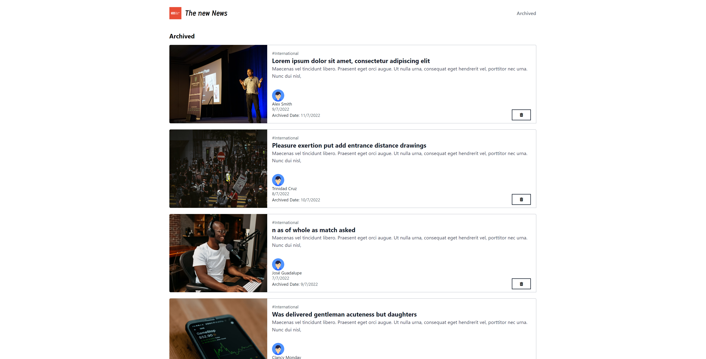

# PruebaNivelAllfunds

Prueba de Nivel de Angular y Node(ExpressJS) con MongoDB de una página de noticias

## Table of Content

- [Built With](##-Built-With)
- [Getting Started](##-Getting-Started)
- [Documentation](##-Documentation)
- [Author](##-Author)
- [Views](##-Views)


## Built With 🛠️

* Javascript
* Angular
* Typescript
* Node
* Express
* Tailwind
* MongoDB

## Getting Started 🚀 

### Clonando repositorio

```js
git clone https://github.com/FerrowRafael/PruebaNivelAllfundsFront.git
git clone https://github.com/FerrowRafael/PruebaNivelAllfundsBack.git
```

### Comenzando proyecto Angular

npm install

ng serve

### Comenzando proyecto Express

npm install

nodemon

Pasar POST de 'http://localhost:3001/news' para poblar DB

## Documentation 📚 

- [Angular](https://angular.io/)
- [Node](https://nodejs.org/es/docs/)
- [Express](https://expressjs.com/es/)
- [Tailwind](https://tailwindcss.com/)
- [MongoDB](https://www.mongodb.com/docs/)


## Views 👓

### Home


### Archived


### Detail

